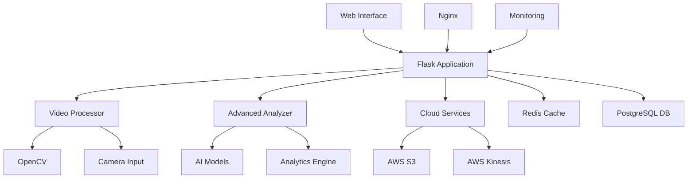

# 🎥 Real-time Video Processing Platform

[](https://python.org)
[](https://flask.palletsprojects.com/)
[](https://opencv.org/)
[](https://aws.amazon.com/)
[](https://docker.com/)
[](LICENSE)

A production-ready, real-time video processing platform with advanced AI analytics, cloud integration, and modern web interface. Built with Flask, OpenCV, and AWS services.

## ✨ Features

### 🎬 Video Processing
- **Real-time webcam streaming** with live processing
- **Multiple detection algorithms**: Face detection, motion detection, object tracking
- **Advanced filters**: Edge detection, blur effects, brightness/contrast adjustment
- **Multi-camera support** with seamless switching
- **Video file upload** and processing capabilities
- **Frame capture** and export functionality

### 🧠 AI & Analytics
- **Advanced AI models** integration (TensorFlow, PyTorch, YOLO support)
- **Real-time analytics** with quality scoring
- **Object detection and tracking** with confidence scores
- **Face recognition** and emotion analysis (optional)
- **Motion analysis** and event detection
- **Performance metrics** and statistics tracking

### ☁️ Cloud Integration
- **AWS S3** integration for frame storage and backup
- **AWS Kinesis** streaming for real-time data processing
- **Cloud model sync** - download/upload ML models
- **Scalable architecture** with cloud-ready deployment
- **Real-time data export** in multiple formats

### 🖥️ Web Interface
- **Modern responsive UI** with Bootstrap 5
- **Real-time controls** for all processing options
- **Live statistics dashboard** with performance metrics
- **Health monitoring** and system status
- **Advanced configuration** panels
- **Mobile-friendly** design with touch controls

### 🚀 Production Ready
- **Docker containerization** with multi-service orchestration
- **Gunicorn WSGI** server for production deployment
- **Nginx reverse proxy** with SSL support
- **Redis caching** for session management
- **PostgreSQL database** for persistent storage
- **Prometheus monitoring** with health checks
- **Automated deployment** scripts and configurations

## 🏗️ Architecture



## 🚀 Quick Start

### Option 1: Automated Setup (Recommended)

```bash
# Clone the repository
git clone https://github.com/AtharvaMohite07/Real-Time-Video-Processing.git
cd Real-Time-Video-Processing

# Run automated setup
python quick_setup.py

# Start the application
python app.py
```

### Option 2: Docker Deployment

```bash
# Clone and start with Docker
git clone https://github.com/AtharvaMohite07/Real-Time-Video-Processing.git
cd Real-Time-Video-Processing

# Start all services
docker-compose up --build

# Access the application at http://localhost:5000
```

### Option 3: Manual Setup

```bash
# Create virtual environment
python -m venv venv
source venv/bin/activate  # On Windows: venv\Scripts\activate

# Install dependencies
pip install -r requirements.txt

# Copy and configure environment
cp .env.example .env
# Edit .env with your configuration

# Start the application
python app.py
```

## 📋 Requirements

### System Requirements
- **Python 3.8+**
- **OpenCV 4.8+**
- **4GB+ RAM** (8GB+ recommended for AI features)
- **Webcam or video input device**
- **Modern web browser** with WebRTC support

### Optional Requirements
- **Docker & Docker Compose** (for containerized deployment)
- **AWS Account** (for cloud features)
- **NVIDIA GPU** (for accelerated AI processing)
- **FFmpeg** (for advanced video processing)

## ⚙️ Configuration

### Environment Variables

Create a `.env` file based on `.env.example`:

```env
# Flask Configuration
SECRET_KEY=your-secret-key-here
FLASK_ENV=development
FLASK_DEBUG=true

# AWS Configuration (Optional)
AWS_ACCESS_KEY_ID=your-access-key
AWS_SECRET_ACCESS_KEY=your-secret-key
AWS_DEFAULT_REGION=us-west-2
S3_BUCKET_NAME=your-video-processing-bucket
KINESIS_STREAM_NAME=video-processing-stream

# Application Settings
MAX_CONTENT_LENGTH=104857600  # 100MB
UPLOAD_FOLDER=uploads
LOG_LEVEL=INFO

# Advanced Features (Optional)
ENABLE_ADVANCED_ANALYSIS=true
ENABLE_CLOUD_SYNC=true
ENABLE_GPU_ACCELERATION=false
```

### AI Models Configuration

The platform supports multiple AI frameworks:

```python
# Configure in advanced_analyzer.py
MODELS_CONFIG = {
    'face_detection': 'haarcascade_frontalface_default.xml',
    'object_detection': 'yolov8n.pt',  # Optional
    'emotion_recognition': 'emotion_model.h5',  # Optional
    'pose_estimation': 'pose_model.pth'  # Optional
}
```

## 🎮 Usage

### Web Interface

1. **Start Processing**: Click "Start" to begin video capture
2. **Configure Filters**: Use the control panel to enable/disable features
3. **Adjust Settings**: Fine-tune brightness, contrast, and detection sensitivity
4. **Monitor Performance**: View real-time statistics and FPS
5. **Capture Frames**: Save interesting frames with the capture button
6. **Upload Videos**: Process pre-recorded video files

### API Endpoints

The platform provides a comprehensive REST API:

```python
# Core Operations
GET  /api/health              # System health check
POST /api/start_camera        # Start video capture
POST /api/stop_camera         # Stop video capture
POST /api/toggle_processing   # Toggle video processing

# Configuration
GET  /api/get_options        # Get current settings
POST /api/update_options     # Update processing options
POST /api/stream_config      # Configure stream settings

# Advanced Features
POST /api/cloud_upload       # Upload frame to cloud
GET  /api/cloud_uploads      # List cloud uploads
POST /api/download_models    # Download AI models
POST /api/export_data        # Export analytics data

# Statistics
GET  /api/stats              # Get processing statistics
POST /api/reset_stats        # Reset statistics
```

### Advanced Features

#### Cloud Integration

```python
# Upload current frame to S3
import requests
response = requests.post('http://localhost:5000/api/cloud_upload', 
                        json={'frame_type': 'current'})

# Configure Kinesis streaming
stream_config = {
    'stream_name': 'video-analytics',
    'partition_key': 'camera-001'
}
```

#### AI Model Management

```python
# Download latest models
response = requests.post('http://localhost:5000/api/download_models')

# Check model status
response = requests.get('http://localhost:5000/api/model_status')
```

## 🐳 Docker Deployment

### Development

```bash
# Start development environment
docker-compose up --build

# View logs
docker-compose logs -f web

# Stop services
docker-compose down
```

### Production

```bash
# Deploy production environment
docker-compose -f docker-compose.prod.yml up -d

# Monitor services
docker-compose -f docker-compose.prod.yml ps

# Update application
./deploy.sh
```

### Services Overview

| Service | Port | Purpose |
|---------|------|---------|
| Web App | 5000/8000 | Main Flask application |
| Nginx | 80, 443 | Reverse proxy & SSL termination |
| Redis | 6379 | Session storage & caching |
| PostgreSQL | 5432 | Database (production only) |
| Prometheus | 9090 | Monitoring & metrics |

## 🔧 Development

### Project Structure

```
Real-Time-Video-Processing/
├── app.py                    # Main Flask application
├── video_analyzer.py         # Core video processing
├── advanced_analyzer.py      # AI and advanced analytics
├── cloud_model_sync.py       # Cloud integration
├── requirements.txt          # Python dependencies
├── docker-compose.yml        # Multi-service setup
├── Dockerfile               # Container definition
├── gunicorn.conf.py         # Production server config
├── nginx.conf               # Reverse proxy config
├── .env.example             # Environment template
├── quick_setup.py           # Automated setup script
├── deploy_production.py     # Production deployment
├── templates/
│   └── index.html           # Web interface
├── static/
│   ├── css/style.css        # Styles
│   └── js/main.js           # Frontend JavaScript
├── uploads/                 # File uploads directory
├── logs/                    # Application logs
└── infrastructure/          # Cloud infrastructure
    ├── cloudformation-template.yaml
    └── lambda_functions/
```

### Adding New Features

1. **Video Filters**: Extend `video_analyzer.py`
2. **AI Models**: Add to `advanced_analyzer.py`
3. **API Endpoints**: Update `app.py`
4. **Frontend Controls**: Modify `templates/index.html`
5. **Cloud Services**: Enhance `cloud_model_sync.py`

### Testing

```bash
# Run tests
pytest tests/

# Test specific component
python -m pytest tests/test_video_analyzer.py

# Test API endpoints
python -m pytest tests/test_api.py

# Integration tests
python -m pytest tests/test_integration.py
```

## 📊 Monitoring

### Built-in Monitoring

- **Health Check**: `/api/health`
- **Real-time Stats**: `/api/stats`
- **Performance Metrics**: Prometheus endpoint
- **System Resources**: CPU, memory, disk usage

### Metrics Dashboard

Access monitoring at `http://localhost:9090` (Prometheus)

Key metrics:
- Processing FPS
- Detection accuracy
- Response times
- Error rates
- Resource utilization

## 🛠️ Troubleshooting

### Common Issues

#### Camera Access
```bash
# Test camera availability
python -c "import cv2; print(cv2.VideoCapture(0).isOpened())"
```

#### Dependencies
```bash
# Reinstall OpenCV
pip uninstall opencv-python
pip install opencv-python==4.8.1.78
```

#### Memory Issues
```bash
# Monitor memory usage
docker stats
# Reduce video resolution or processing frequency
```

#### AWS Configuration
```bash
# Test AWS credentials
aws sts get-caller-identity
# Verify S3 access
aws s3 ls s3://your-bucket-name
```

### Performance Optimization

1. **Enable GPU acceleration** (if available)
2. **Adjust processing resolution** for better FPS
3. **Use Redis caching** for frequent operations
4. **Optimize Docker resources** allocation
5. **Configure Nginx caching** for static assets

## 🚀 Production Deployment

### Automated Production Setup

```bash
# Run production wizard
python deploy_production.py setup

# Deploy to production
./deploy.sh
```

### Manual Production Steps

1. **Server Setup** (Ubuntu/CentOS)
2. **Docker Installation**
3. **SSL Certificate** configuration
4. **Firewall** setup
5. **Monitoring** setup
6. **Backup** strategy

Detailed deployment guide: [`DEPLOYMENT.md`](DEPLOYMENT.md)

## 📚 Documentation

### 📖 Core Documentation
- **[README.md](README.md)** - This main overview (you are here)
- **[Detailed Documentation](docs/README_DETAILED.md)** - Comprehensive technical guide
- **[Contributing Guidelines](CONTRIBUTING.md)** - How to contribute to the project

### 🚀 Setup & Deployment
- **[Quick Setup Guide](docs/DEPLOYMENT_CHECKLIST.md)** - Step-by-step setup instructions
- **[Deployment Guide](docs/DEPLOYMENT.md)** - Complete deployment documentation
- **[AWS Free Tier Setup](docs/AWS_FREE_SETUP_GUIDE.md)** - AWS cloud integration guide
- **[GitHub Upload Guide](docs/GITHUB_READY.md)** - Instructions for GitHub deployment

### 📊 Project Information
- **[Project Summary](docs/PROJECT_SUMMARY.md)** - Technical overview and accomplishments
- **[Code Quality Analysis](docs/CODE_ISSUES_ANALYSIS.md)** - Code review and fixes documentation
- **[Documentation Review](docs/DOCUMENTATION_REVIEW.md)** - Documentation quality assessment

## 🤝 Contributing

We welcome contributions! Please see [`CONTRIBUTING.md`](CONTRIBUTING.md) for guidelines.

### Development Setup

1. Fork the repository
2. Create a feature branch
3. Make your changes
4. Add tests
5. Submit a pull request

### Code Style

- Follow PEP 8 for Python code
- Use ESLint for JavaScript
- Write comprehensive tests
- Document all functions
- Use meaningful commit messages

## 📝 License

This project is licensed under the MIT License - see the [`LICENSE`](LICENSE) file for details.

## 🙏 Acknowledgments

- **OpenCV** community for computer vision tools
- **Flask** team for the excellent web framework
- **AWS** for cloud services integration
- **Bootstrap** for the UI components
- **Contributors** who help improve this project

## 📞 Support

- **Documentation**: [Project Wiki](https://github.com/AtharvaMohite07/Real-Time-Video-Processing/wiki)
- **Issues**: [GitHub Issues](https://github.com/AtharvaMohite07/Real-Time-Video-Processing/issues)
- **Discussions**: [GitHub Discussions](https://github.com/AtharvaMohite07/Real-Time-Video-Processing/discussions)
- **Email**: support@example.com

---

**🌟 Star this repository if you find it helpful!**

Made with ❤️ by the Real-time Video Processing Team
